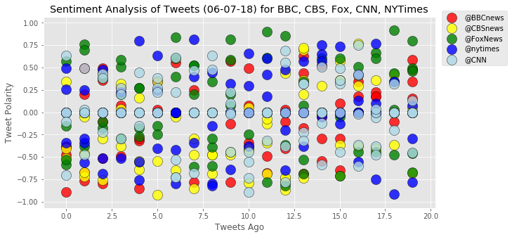
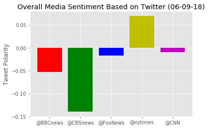

```python
# Dependencies
import tweepy
import numpy as np
import pandas as pd
from datetime import datetime
import matplotlib.pyplot as plt
from matplotlib import style

style.use('ggplot')

# Import and Initialize Sentiment Analyzer
from vaderSentiment.vaderSentiment import SentimentIntensityAnalyzer
analyzer = SentimentIntensityAnalyzer()

# Twitter API Keys
from config import (consumer_key,
                    consumer_secret,
                    access_token,
                    access_token_secret)

# Setup Tweepy API Authentication
auth = tweepy.OAuthHandler(consumer_key, consumer_secret)
auth.set_access_token(access_token, access_token_secret)
api = tweepy.API(auth, parser=tweepy.parsers.JSONParser())

```


```python
#Observations
#1.
#2.
#3.
```


```python
# Target Account


target_user = ["@BBCnews", "@CBSnews", "@FoxNews", "@nytimes", "@CNN"]


# Variables for holding sentiments
sentiments = []

# Variable for max_id
oldest_tweet = None


for users in target_user:

# Loop through 5 pages of tweets (total 100 tweets)
    for x in range(5):
        
        # Counter
        counter = 0

        # Get all tweets from home feed
        public_tweets = api.user_timeline(users, max_id = oldest_tweet)

        # Loop through all tweets 
        for tweet in public_tweets:

            #Print Tweets
            print("Tweet %s: %s" % (counter, tweet["text"]))
        
            # Run Vader Analysis on each tweet
            results = analyzer.polarity_scores(tweet["text"])
            compound = results["compound"]
            pos = results["pos"]
            neu = results["neu"]
            neg = results["neg"]
            tweets_ago = counter
            account = users
        
            # Get Tweet ID, subtract 1, and assign to oldest_tweet
            oldest_tweet = tweet['id'] - 1

            # Add sentiments for each tweet into a list
            sentiments.append({"Date": tweet["created_at"], 
                               "Compound": compound,
                               "Positive": pos,
                               "Negative": neu,
                               "Neutral": neg,
                               "Tweets Ago": counter, 
                               "Account": users})

            # Add to counter 
            counter += 1
    
```

    Tweet 0: The wrong turn that led to the World Cup https://t.co/djEDEKFPeK
    Tweet 1: The terrible speed the Grenfell fire spread https://t.co/WS6cPXrxke
    Tweet 2: Lily Allen on her demons, divorce and laughter https://t.co/DyTqMLDi2O
    Tweet 3: Turkey’s Erdogan faces surprise test in tight vote https://t.co/Xkc8LQSJRx
    Tweet 4: The children who hear 'terrifying' voices https://t.co/buFFd8AVef
    Tweet 5: Making food crops that feed themselves https://t.co/uwix6h5HTt
    Tweet 6: How does the way you talk define your identity? https://t.co/yzjMnRBKnS
    Tweet 7: Has your commute turned into a nightmare? https://t.co/jAt3gcW8OF
    Tweet 8: Quiz: What did Alice call Kim? https://t.co/iJKXU7ZBkj
    Tweet 9: Brixton portraits celebrate life and soul of the street https://t.co/DnOzjxfznp
    Tweet 10: Michael McIntyre laughs off moped mugging at Dublin show https://t.co/Xft2yDqMya
    Tweet 11: Tesco boss blames business rates for retail woes https://t.co/7J2mVYyTPd
    Tweet 12: Military boss defends RAF bombings of IS https://t.co/peiVpHSu0x
    Tweet 13: Theresa May attacks 'vile' online threats against women https://t.co/imU6dd2FQv
    Tweet 14: Newspaper headlines: Boris 'taped attacking Treasury' and 'Ghost Town Britain' https://t.co/vBPjSfqOiX
    Tweet 15: French Open 2018: How do you stop 'King of clay' Rafael Nadal? https://t.co/heHOFipZKA
    Tweet 16: England v Costa Rica: Marcus Rashford played with a real swagger, says Gareth Southgate https://t.co/3p9HMprkjv
    Tweet 17: Premier League rights: What does Amazon deal mean for rivals, the league and fans? https://t.co/lRUsZkLUqY
    Tweet 18: Boris Johnson 'warns of Brexit meltdown' https://t.co/XCkbCnLdCA
    Tweet 19: Friday’s Daily Mail: "Hammond gets both barrels from Boris" #tomorrowspaperstoday #bbcpapers (via @BBCHelenaLee) https://t.co/OCMckzD8S0
    Tweet 0: Friday’s Times: "‘We must take the fight to the enemy’" #tomorrowspaperstoday #bbcpapers (via @BBChelenalee)  https://t.co/c7QKfjOeaI
    Tweet 1: Friday’s Sun: "2 fingers of fudge" #tomorrowspaperstoday #bbcpapers (via @BBChelenalee) https://t.co/PkBKLOKl5l
    Tweet 2: Friday’s Guardian: "Failing high street chains leave 11,000 more jobs under threat" #tomorrowspaperstoday… https://t.co/3LiLGHYDH5
    Tweet 3: Friday’s i: "Destroyed by internet shopping" #tomorrowspaperstoday #bbcpapers (via @BBChelenalee) https://t.co/esDDZ0kYJ6
    Tweet 4: Friday’s Mirror: "Ghost town Britain" #tomorrowspaperstoday #bbcpapers (via @BBChelenalee)  https://t.co/mBvld34JSC
    Tweet 5: Friday’s Express: "Brexit back on track" #tomorrowspaperstoday #bbcpapers (via @BBChelenalee) https://t.co/ELDUGaZTAV
    Tweet 6: Friday’s Telegraph: "Boris: May must show more guts on Brexit" #tomorrowspaperstoday #bbcpapers (via @BBChelenalee) https://t.co/EnYJmF1umn
    Tweet 7: Friday’s Financial Times: "High Street crisis leaves 13,000 retail jobs in peril" #tomorrowspaperstoday #bbcpapers… https://t.co/siDuVB0MqP
    Tweet 8: Friday’s City AM: "MPs tell TSB: It’s time for Pester to go" #tomorrowspaperstoday #bbcpapers (via @BBChelenalee) https://t.co/abHOwjdwbK
    Tweet 9: Friday’s Metro: "Police probe the Grenfell firefighters" #tomorrowspaperstoday #bbcpapers (via @BBChelenalee) https://t.co/l1lTd0mbNZ
    Tweet 10: Anthony Joshua v Alexander Povetkin: WBA title fight deal close https://t.co/BFl1gh2ICH
    Tweet 11: Transgender man wants to be named father https://t.co/rmaobjdidR
    Tweet 12: World Cup warm-up match: England 2-0 Costa Rica https://t.co/la76K5qFyH
    Tweet 13: Max Verstappen: Red Bull driver says he 'might headbutt someone' https://t.co/Wq8J9U2lAP
    Tweet 14: RT @BBCSport: Full time: England 2-0 Costa Rica. 
    
    A super strike from Marcus Rashford and a header from Danny Welbeck send England off to…
    Tweet 15: Ask Putin: The phone-in with a difference https://t.co/hRHx3ExkFf
    Tweet 16: New Prince album announced on 60th birthday https://t.co/TGLgTl5gW9
    Tweet 17: RT @BBCSport: GOAL! England 2-0 Costa Rica. 
    
    There's the second! Dele Alli drives forward and crosses for a diving Danny Welbeck to head h…
    Tweet 18: Water Plus sends customer bill for £16,584 https://t.co/rb1vmMo1FZ
    Tweet 19: Trump-Kim summit: North Korea leader may get US invite https://t.co/8Q0lPstVVL
    Tweet 0: Nabil Fekir: Liverpool close to £53m deal for Frenchman https://t.co/wtsklNPTKS
    Tweet 1: Kate Spade death: Mental illness 'doesn't discriminate' https://t.co/bwfkmhazMI
    Tweet 2: Why is House of Fraser failing? https://t.co/Wd8U7SUB7m
    Tweet 3: 2019 Women's World Cup qualifiers: Wales 1-0 Bosnia-Herzegovina https://t.co/FN6BkKXLVP
    Tweet 4: Kate Spade: Death ruled suicide by medical examiner https://t.co/1mGMDWHoYw
    Tweet 5: Dina Asher-Smith sets new British 100m record at Diamond League Bislett Games https://t.co/bbfvlcppL8
    Tweet 6: England v Costa Rica - rate the players https://t.co/tloyfqfOXm
    Tweet 7: MPs have 'lost confidence' in TSB chief https://t.co/6JTpXu0Ccg
    Tweet 8: RT @BBCSport: GOAL! England 1-0 Costa Rica. 
    
    Something out of nothing from Marcus Rashford. He finds a pocket of space and lets fly from o…
    Tweet 9: Key 'step forward' in cutting cost of removing CO2 from air https://t.co/pmqre5ab0U
    Tweet 10: The X Factor: Louis Walsh leaves after 13 'fantastic' years https://t.co/8vWscr7PEZ
    Tweet 11: Geordie Greig to be new Daily Mail editor https://t.co/z9GiMwEDnu
    Tweet 12: Lewis Hamilton says society is 'in stone age' on equal pay and racial equality https://t.co/dBz3bLy3Sd
    Tweet 13: RT @bbcweather: Cloudy at times tomorrow with the chance of a few showers in the west and south. However, it will be warm again away from N…
    Tweet 14: RT @richard_conway: I’m told Richard Scudamore kept his decision to leave his position at the Premier League a secret from the clubs - only…
    Tweet 15: Israeli PM Netanyahu: Iran nuclear deal is dead https://t.co/5tYXMCHCbD
    Tweet 16: Donald Glover as Willy Wonka? Fictional characters' changing races https://t.co/MjCSASJoi2
    Tweet 17: For all your #Brexit needs
    
    https://t.co/vrwoJgDi3Z https://t.co/ovUB6LSlc1
    Tweet 18: Reality Check: What do Brexit backstop proposals mean? https://t.co/FyZNAlCadU
    Tweet 19: Daniel Radcliffe to play a fact-checker on Broadway https://t.co/cLFwgiFAQ9
    Tweet 0: Violent crime: Is it getting worse? https://t.co/LQFS0gMo3E
    Tweet 1: A Star is Born? Lady Gaga's feature film debut praised https://t.co/SOlB3QuTZs
    Tweet 2: Peter Stringfellow: Celebrities pay tribute for 'good times' https://t.co/YLcPnno8tY
    Tweet 3: Korean woman survives six days in Australian wilderness https://t.co/cR7lsG1MJX
    Tweet 4: Boy attends gig as Gary Barlow's guest after missing out on tickets https://t.co/OGw3t2d5kz
    Tweet 5: Richard Scudamore: Premier League chief to stand down by end of 2018 https://t.co/BRI8zoQfza
    Tweet 6: House of Fraser: Reaction to 'devastating' closures https://t.co/4wjfI2NIHz
    Tweet 7: RT @BBCSport: The Premier League's executive chairman Richard Scudamore is to stand down by the end of 2018 after nearly 20 years in the ro…
    Tweet 8: How a BBC crew was followed in World Cup 2018 Russia https://t.co/G0KbiMYYT4
    Tweet 9: Sir Richard Branson: Ditch diesel for electric cars before 2040 https://t.co/cP7qHGWinW
    Tweet 10: Belfast woman to challenge NI abortion law https://t.co/eC6wRnud8j
    Tweet 11: Govia Thameslink provides taxis to get pupils to GCSE exams https://t.co/MIf7BC1Rm5
    Tweet 12: French Open 2018: Simona Halep beats Garbine Muguruza to reach final https://t.co/m6dhxdAAxx
    Tweet 13: G7 summit: Trapped in the world's most secure house https://t.co/wgu9GMQgNX
    Tweet 14: RT @bbclaurak: The backstop blues.... 'if she can't even boss it here, can we go on?" https://t.co/ItqDED0ou5
    Tweet 15: RT @BBCkatyaadler: The EU doesn‘t like the reference to a time-limit; it won’t cut the mustard for them as an Irish border backstop. While…
    Tweet 16: RT @BBCkatyaadler: The U.K. proposal for an if-all-else-fails backstop on customs relations with the EU -aimed at not alienating anyone - i…
    Tweet 17: World Cup Catch-Up: France 98 https://t.co/SqKC0AjaJL
    Tweet 18: After crunch talks between PM &amp; #Brexit Secretary David Davis, UK's "backstop" plan for EU trade published — with a… https://t.co/gTmF22laMY
    Tweet 19: How YouTube is changing the face of beauty https://t.co/PnopPrgipO
    Tweet 0: NBA finals: LeBron James's off the board dunk can't save Cleveland Cavaliers https://t.co/TGMrcxKiGv
    Tweet 1: RT @BBCNormanS: Theresa May agrees end date for Brexit backstop - 31st Dec 2021
    Tweet 2: RT @rosschawkins: "expects" is doing a lot of hard work here https://t.co/pooxxXolXP
    Tweet 3: RT @ChrisMasonBBC: Crucial sentence from the govt, on p6: "The UK expects the future arrangement to be in place by the end of December 2021…
    Tweet 4: Who kidnapped the Derby-winner Shergar and why? https://t.co/cLSotNqqTw
    Tweet 5: French Open 2018: Rafael Nadal beats Digeo Schwartzman to reach semis https://t.co/CSfkDT7zaG
    Tweet 6: RT @BBCSport: Aston Villa say they have reached an agreement with HM Revenue &amp; Customs over their £4m tax bill.
    
    ➡️ https://t.co/r6h23WOMCu…
    Tweet 7: Follow the latest news on the #Brexit "backstop" row with @bbclaurak 
    
    https://t.co/PZv6E9SpG6 https://t.co/MaVM4aQhPw
    Tweet 8: South Africa v England: Uncapped forward Brad Shields on bench for England https://t.co/ZmHps7kjhw
    Tweet 9: Stockholm lorry attacker Rakhmat Akilov jailed for life https://t.co/Jcwtp3ieKQ
    Tweet 10: Police to probe fire service over Grenfell https://t.co/upRt0c1IUt
    Tweet 11: RT @ChrisMasonBBC: Workers on South Western Railway are to stage a three-day strike from June 21 in the long-running dispute over the role…
    Tweet 12: Theresa May holding more talks with #Brexit Secretary David Davis amid tensions over the UK's Brexit "backstop" pla… https://t.co/XCp4XN14FC
    Tweet 13: RT @BBCSport: Amazon will show 20 Premier League matches a season for three years from 2019, after winning one of the final two broadcast p…
    Tweet 14: RT @bbclaurak: Earlier meeting ended with no conclusion
    Tweet 15: RT @bbclaurak: Davis has now been called BACK in to see the PM
    Tweet 16: Premier League TV rights: Amazon to show 20 matches a season from 2019-2022 https://t.co/f5UA2qXPgo
    Tweet 17: RT @richard_conway: From 2019/20 Amazon Prime members will have “exclusive access to watch 20 matches per season, comprising two full fixtu…
    Tweet 18: RT @richard_conway: https://t.co/XdixoBDEHg
    Tweet 19: RT @richard_conway: CONFIRMED: Amazon secure Premier League TV rights package for UK.
    Tweet 0: Samantha Bee addresses Ivanka Trump controversy: "I should have known that a potty-mouthed insult would be inherent… https://t.co/QI91JHmqXE
    Tweet 1: Matthew Charles reformed his life when his prison sentence was shortened in 2016. Now a Tennessee judge is sending… https://t.co/qrLjk9cQOm
    Tweet 2: Family of Japanese abductee to President Trump: You are our family’s last hope
    https://t.co/b2FWlaz57p https://t.co/p6Su3v3da6
    Tweet 3: Republicans prepare for major immigration meeting Thursday https://t.co/Kh0Rr866RK https://t.co/2qTqlnkXCD
    Tweet 4: Guatemala and Hawaii volcanoes: How do they stack up? https://t.co/IwK6U6U578 https://t.co/mcSIbIPYSz
    Tweet 5: Security monitor told police he saw Florida gunman minutes before massacre https://t.co/LQyGGzCLsK https://t.co/tD671GvzHN
    Tweet 6: Woman catches foul ball in beer at Padres game, proceeds to chug the beer with the ball in it… https://t.co/qMNcK8V9ip
    Tweet 7: Europe to impose retaliatory tariffs on U.S. imports https://t.co/3SkBZc1pB5 https://t.co/DymKZXxjCQ
    Tweet 8: Undocumented immigrant arrested while trying to deliver pizza to military base https://t.co/30aKrbWCh3 https://t.co/tj1eSxkdXp
    Tweet 9: Real estate headache: Baby boomers who won't sell their homes https://t.co/4WubITAuSR https://t.co/yLdLxNF18d
    Tweet 10: 120-pound dog carried down mountain by rescue team after suffering dehydration https://t.co/4KgEqxpHmS https://t.co/6lLYIzkgiT
    Tweet 11: Possible intended target in Ariz. murder spree: “I knew what the connection was" https://t.co/wSrRbjBPvm https://t.co/2z6sc937Jf
    Tweet 12: Details emerge about Kate Spade's suicide note, personal struggles https://t.co/ohV6jIv3KB https://t.co/XmjTWGtYeu
    Tweet 13: Top EPA aide Millan Hupp is leaving https://t.co/HPpGOC53Cj https://t.co/7Ot6P4sBKo
    Tweet 14: Chris Farley's family sues Trek over name of fat-tired bikes https://t.co/0buFPCyL79 https://t.co/jccK98YyUr
    Tweet 15: Soldier accused of stealing armored vehicle seemed to foreshadow plan with tweet https://t.co/FbhrEvLJ7Y
    Tweet 16: KFC creating vegetarian version of its fried chicken in U.K. https://t.co/PuDshIwaxB https://t.co/xQwgyajVIg
    Tweet 17: CFPB chief Mick Mulvaney disbands consumer protection board https://t.co/sIyJhGUGrR https://t.co/H9tyVH5rZT
    Tweet 18: Severed rattlesnake head bites man who decapitated it https://t.co/gz1A1Bazvu https://t.co/kBHOHZKys6
    Tweet 19: Grim end to multi-state search for father suspected of fleeing with toddler son https://t.co/eYnM4LDHFU https://t.co/YNcKBb2IjG
    Tweet 0: Comcast Xfinity outage: Businesses across U.S. lose phone service https://t.co/WusND1ETh7 https://t.co/i8llQbvg8T
    Tweet 1: Mesa officers placed on leave after video shows them repeatedly punching man https://t.co/PGvpdZiN5Y https://t.co/ZCMe7PSbe6
    Tweet 2: Steel workers ask Trump to halt metal tariffs https://t.co/WZjYI4Hyms https://t.co/788U9tLEvH
    Tweet 3: In new documentary, David Cassidy says he lied about his health https://t.co/hfYfrb9dSY https://t.co/EdHoAja9o1
    Tweet 4: Crocodile fatally mauls pastor baptizing followers at lake https://t.co/T9iH0hjOKA https://t.co/Cl4amm8iFA
    Tweet 5: Serial child rapist, whose pending release drew outcry, arrested on new charges https://t.co/BknL8tMZ3b https://t.co/ZMo68Zwo8A
    Tweet 6: Guatemala and Hawaii volcanoes: How do they stack up? https://t.co/cYPytZC8Rq https://t.co/OJN5JfvNG8
    Tweet 7: Kate Spade suicide: Andy Spade gives statement after designer's death https://t.co/fjJoJI75uo https://t.co/VwWMgo5pMu
    Tweet 8: Woman catches foul ball in beer at Padres game, proceeds to chug the beer with the ball in it… https://t.co/vwQrtdgme6
    Tweet 9: Undocumented immigrant arrested while trying to deliver pizza to military base https://t.co/AU0yrZY9Yv https://t.co/FyDdqrRARO
    Tweet 10: Details emerge about Kate Spade's suicide note, personal struggles https://t.co/0XaY6yLDI6 https://t.co/cH4G7IpO9Z
    Tweet 11: Former Obama adviser Ben Rhodes gives rapid fire opinions of foreign leaders including Kim Jong Un, Angela Merkel o… https://t.co/CXYMkBbdtE
    Tweet 12: Man repeatedly rams an SUV, tears off parts of the car and jumps on its roof in a strange road rage incident that s… https://t.co/p0LJb6tZpN
    Tweet 13: "This is the greatest day of my life." Alice Marie Johnson embraces her family in an emotional reunion after Presid… https://t.co/wiSC2Bd6KM
    Tweet 14: “Sex and the City” turns 20 today but the show’s biggest theme is still relevant https://t.co/le20Pgt4Aw
    Tweet 15: Experts say the U.S. and North Korea could agree on a framework to denuclearize and open up channels of communicati… https://t.co/Jhrp2vQ1jl
    Tweet 16: "Your own story doesn't go away" because you're working in the White House, former President Obama's deputy nationa… https://t.co/fQJj9kC0UB
    Tweet 17: Stormy Daniels suit claims ex-lawyer colluded with Michael Cohen, Pres. Trump and Fox News https://t.co/jgl0XuTmao https://t.co/6bJpRUl8sM
    Tweet 18: RT @CBSThisMorning: WATCH: @Oprah Winfrey is checking out her brand new #WatchingOprah exhibit for the first time, opening Friday at @NMAAH…
    Tweet 19: GOP Sen. Ernst says EPA chief Scott Pruitt "did lie" on ethanol pledge, is "undercutting" President Trump… https://t.co/zjKrVhv1zN
    Tweet 0: Netflix announced on Wednesday that it is renewing hit teen drama "13 Reasons Why" for another season… https://t.co/sfdZ1fNDqn
    Tweet 1: "When you're my age, there's gotta be some things you can get away with,": Equity Group Investments founder uses cr… https://t.co/xqSGHxLMJQ
    Tweet 2: A Texas courtroom burst into chaos on Tuesday after defendant Daniel Moreno Lopez was found guilty of a gruesome mu… https://t.co/Y1xDcN3nEo
    Tweet 3: This alligator is a fighter: Florida animal knocks Fish and Wildlife officer out cold as he tries to escape capture… https://t.co/cXR9QwsgKK
    Tweet 4: Robert F. Kennedy died 50 years ago today, assassinated as he campaigned for president. 
    
    @jdickerson takes us back… https://t.co/so22oxexXm
    Tweet 5: Voters unseated Judge Aaron Persky for giving what many thought was a weak sentence in a disturbing sexual assault… https://t.co/DwSH1wg7ip
    Tweet 6: In the Phoenix suburb of Mesa, Arizona, four officers were put on paid administrative leave after surveillance vide… https://t.co/mnEeUhNzNu
    Tweet 7: A contractor was arrested as he reported for work at the White House yesterday. He had been wanted for weeks for at… https://t.co/9I6hSIHLZF
    Tweet 8: Five days before the nuclear summit with North Korea, President Trump's lawyer Rudy Giuliani made a few waves with… https://t.co/CMkmt8bY1C
    Tweet 9: A barrage of hail stones hit Dallas overnight with frightening force. @DavidBegnaud has more. https://t.co/t19Rnxg0mg
    Tweet 10: U.S. Air Force flew several children injured in the Guatemalan volcano explosion to the U.S. for treatment of burns… https://t.co/5rlbyuSmUy
    Tweet 11: Pres. Trump granted clemency to Alice Johnson, a first-time nonviolent drug offender. She had a high-profile advoca… https://t.co/nBIJnr2Eyo
    Tweet 12: RT @CBSEveningNews: We’re on the air in the East. @JeffGlor is live from Studio 57 in NYC
    
    Thanks for being with us #OriginalReporting #CBS…
    Tweet 13: "Solo: A Star Wars Story" may chart a new path for the storied sci-fi franchise -- by losing money.… https://t.co/DBr1rwYlML
    Tweet 14: Jerry Maren, the last surviving member of the group of actors who portrayed the munchkins from "The Wizard of Oz,"… https://t.co/S03n5FI3Zo
    Tweet 15: Severed rattlesnake head bites Texas man who decapitated it https://t.co/dfMHVKShlY https://t.co/Ai7qbJGRdC
    Tweet 16: Zach Wahls, the Iowa activist who catapulted to internet fame with a viral same-sex moms speech on YouTube, won the… https://t.co/ny36YAbgP9
    Tweet 17: A mother and her disabled son were "kicked out" of a @deadpoolmovie screening after moviegoers complained of "too m… https://t.co/Ja2GhaEFTn
    Tweet 18: WATCH: When Florida Fish and Wildlife officials show up to catch a feisty alligator, it head butts one of them, kno… https://t.co/sDsC9HQtBM
    Tweet 19: 120-pound 5-year-old carried down mountain by rescue team after suffering dehydration. He was a big, fluffy dog nam… https://t.co/K91lFv5Jbx
    Tweet 0: Democrats easily flip Missouri state senate seat Republicans have held for more than a decade… https://t.co/TVDNuRXcVL
    Tweet 1: Severe storms, including baseball-sized hail, left a trail of destruction in Texas overnight https://t.co/DerFBFrxsv https://t.co/VzEZbpkUwS
    Tweet 2: Woman catches foul ball in beer cup at Padres game, proceeds to chug the beer with the ball in it… https://t.co/33ArVMffm8
    Tweet 3: Federal judge rules Trump administration cannot cut off grants to Philadelphia over "sanctuary city" fight:… https://t.co/1zzWAiV4oE
    Tweet 4: Crocodile kills pastor performing baptism on lake https://t.co/62AFAIyOqp https://t.co/LmPK8AcGrU
    Tweet 5: House Speaker Paul Ryan breaks with President Trump on "spygate" claim: https://t.co/HI0d9JKwQX https://t.co/yvmt6kwWvO
    Tweet 6: “We’ve had three devastating major hurricanes that hit our country within a month's time,” President Trump says. “A… https://t.co/3Orv6qh3oN
    Tweet 7: WATCH LIVE: President Trump receives 2018 hurricane season briefing at FEMA headquarters https://t.co/HaKdP42Znv https://t.co/02GFuEyHMZ
    Tweet 8: Colonel Sanders may be rolling over in his grave: KFC is devising a fake meat version with the colonel's tightly he… https://t.co/PDB0olpUmw
    Tweet 9: A man took a knee during the national anthem at the White House's "Celebration of America" event on Tuesday:… https://t.co/758QPRqG0z
    Tweet 10: UPS workers have given their union the go-ahead to call a strike in what would be their first walkout in decades… https://t.co/q7zQZ44q9L
    Tweet 11: "We're talking everything through. There may be disagreements. I regard this as much like a family quarrel. I'm alw… https://t.co/9D1GOSG7mG
    Tweet 12: Bobby Kennedy died 50 years ago today, after an assassination that shocked the nation. https://t.co/nLmV77t3CN… https://t.co/t1xwEoEBzA
    Tweet 13: "This is not the Chinese government buying a bunch of natural gas and soybeans from America. This is about reducing… https://t.co/TqmCOTNt5t
    Tweet 14: WATCH LIVE: Director of the National Economic Council Larry Kudlow holds a press briefing on the G7 conference… https://t.co/FBjjHP3ZIV
    Tweet 15: President Trump commutes the life sentence of Alice Marie Johnson after her case was championed by Kim Kardashian W… https://t.co/MzOV8qTJYo
    Tweet 16: About 100 firefighters battle blaze at a luxury hotel in London; video footage shows smoke billowing from the roof… https://t.co/q40GrOBdwd
    Tweet 17: Too close for comfort: A woman captured video of a black fin shark swimming just off the coast of Myrtle Beach, pro… https://t.co/74L7mE1bRJ
    Tweet 18: WATCH: President Trump is signing the VA Mission Act, which will facilitate military veterans' access to private-se… https://t.co/WE1QY2NYPY
    Tweet 19: GOP Senate report says Obama officials gave Iran access to U.S. financial system https://t.co/uQ2uI2IlUk https://t.co/SqOXiKuj6O
    Tweet 0: Former New York City Mayor Rudy Giuliani says North Korean leader Kim Jong Un got "on his hands and knees and begge… https://t.co/Edm9hrv3qY
    Tweet 1: Severe storms, including hail the size of baseballs, left a trail of damage in Texas overnight: "It actually sounde… https://t.co/F0S5mRDS4d
    Tweet 2: Cambridge Analytica chief Alexander Nix accused of taking $8M from company ahead of its recent collapse… https://t.co/uQt5Ko8H2o
    Tweet 3: President Trump and North Korean leader Kim Jong Un will use a luxury resort for their nuclear summit in Singapore… https://t.co/qVBuCeM27l
    Tweet 4: Fire fighters brought out the vacuum for this rescue. But they weren't cleaning, they were sucking ducks out of a h… https://t.co/6bxqjrUKrw
    Tweet 5: “Why was it canceled? Probably because we didn't go. I mean, we could have, but … we wanted to get work in and got… https://t.co/WUcboR3VMp
    Tweet 6: "I'm not discussing it. It's over. What you have seen and what you heard is enough," Philadelphia Eagles coach Doug… https://t.co/DynG4hFy9y
    Tweet 7: MOMENTS AGO: Philadelphia Eagles' coach Doug Pederson is talking to the press for the first time since the team was… https://t.co/Py0j25blzT
    Tweet 8: California voters recall judge who sentenced Brock Turner to short jail sentence for sexually assaulting a young wo… https://t.co/ytfSdZ1Tde
    Tweet 9: Rep. Steve Scalise makes return to congressional baseball practice one year after he was shot… https://t.co/vYhUPbf0AA
    Tweet 10: At dawn, 74 years ago today, American troops landed on the beaches of Normandy for #DDay https://t.co/kZkMDX4NYy https://t.co/7keHgWnR3a
    Tweet 11: GOP Senate report says Obama officials gave Iran access to U.S. financial system
    https://t.co/wtrSoueTqq https://t.co/pCN0FMX1Al
    Tweet 12: Is the Earth angry? Two volcanoes had massive eruptions in the past few weeks, causing wide spread devastation in H… https://t.co/S0kZlRbiCp
    Tweet 13: WATCH: Police successfully rescued a baby girl from a volcanic ash-covered home near Guatemala's Volcan de Fuego… https://t.co/P5r7UxhLRb
    Tweet 14: Single mom who went into labor during final exam graduates from Harvard Law School https://t.co/YsBOky9QEv https://t.co/u4fWmxIejp
    Tweet 15: Sen. Robert Kennedy was assassinated 50 years ago, just moments after he won the California presidential primary. A… https://t.co/lfHSEK4CJX
    Tweet 16: Woman punched by New Jersey officer on the beach: "I'm not a criminal"
    https://t.co/Gn29V1Hqv1 https://t.co/LjFlUq3lEN
    Tweet 17: Starbucks recently revealed its plans to build nearly 3,000 new stores in mainland China over the next five years,… https://t.co/7REh52vs8g
    Tweet 18: Headspace is a popular meditation app that aims to bring mindfulness to the masses. The app provides guided meditat… https://t.co/qU04mCTKbl
    Tweet 19: Facebook is under new scrutiny after acknowledging data-sharing partnerships with at least 4 Chinese electronic com… https://t.co/sdK4gW2zbR
    Tweet 0: RT @FoxNewsResearch: #OTD in 1944 → #DDay
    
    •The Normandy invasion, code-named Operation Overlord, was the largest amphibious assault in his…
    Tweet 1: On this day in 1944, Allied troops landed along a stretch of fortified coastline to fight Nazi Germany on the beach… https://t.co/yY5G1LVBhb
    Tweet 2: .@newtgingrich on @foxandfriends: “The Democrats have been shockingly unpatriotic in deliberately keeping all sorts… https://t.co/JzvpxZqOkp
    Tweet 3: .@newtgingrich on @foxandfriends: “I think that this is the moment to do welfare reform to encourage people to get… https://t.co/zWLwbIfxX4
    Tweet 4: Remembering #DDay @FoxFriendsFirst https://t.co/YbgIpgjiH4
    Tweet 5: Singapore hotel hosting Trump-Kim summit is on secluded island with pirate ties https://t.co/JqWjGP2Pdn
    Tweet 6: Ceejay Metcalf on meeting @POTUS: “It was absolutely wonderful.” @foxandfriends https://t.co/BzutzMXar1
    Tweet 7: IHOP says it's changing iconic name; pancake lovers flip out https://t.co/wzFyKy4Gto
    Tweet 8: .@JaniceDean gives an update on the weather on @FoxFriendsFirst https://t.co/85nhRz1wFg
    Tweet 9: OPINION: Remembering D-Day: The day we knew we were going to win (via @FoxNewsOpinion) https://t.co/lYUoGnuqJA
    Tweet 10: .@POTUS and @FLOTUS to meet with @FEMA today @FoxFriendsFirst https://t.co/8aXUr8opdj
    Tweet 11: Kate Spade suffered from depression for years, sister says https://t.co/wqHHK2DDUc https://t.co/QxoVtGkBC9
    Tweet 12: OPINION: @MarcThiessen: Shame on Google for treating the US military as evil https://t.co/ZUqa4j4nmn
    Tweet 13: .@POTUS applauds @SenateMajLdr for skipping recess https://t.co/ae37dsiGd9 @FoxFriendsFirst https://t.co/vEy62O00Cb
    Tweet 14: Today marks the 74th anniversary of #DDay @foxandfriends https://t.co/NLjKLwbujY
    Tweet 15: .@Eagles coach to address canceled @WhiteHouse visit https://t.co/sSjnEdcMcc
    Tweet 16: .@WhiteHouse announces location of Trump-Kim summit in Singapore https://t.co/mMOdXQVZdq https://t.co/ku4qAB5O2T
    Tweet 17: ICE raids Ohio lawn and garden business, arrests 114 https://t.co/cpiiGkmm9S
    Tweet 18: Photo of Tennessee firefighter cradling little girl after car accident goes viral https://t.co/qHFR8H09fz https://t.co/uD7knwhQnq
    Tweet 19: Alabama Republican who un-endorsed Trump in 2016 forced into runoff election https://t.co/yBUhzZL4IB
    Tweet 0: Miss America dropping the swimsuit competition  from its nationally televised broadcast https://t.co/ZdVzkxqIYP
    Tweet 1: Jessica Vaughan: “We think that it’s important to have more immigration enforcement, border security, a strong lega… https://t.co/DokzeS0Y1T
    Tweet 2: A man kneeled during the National Anthem at an event billed as a celebration of the American flag with Eagles fans.… https://t.co/wdDnK0U9Tt
    Tweet 3: Arkansas police officers and firefighters surprise a teen with autism at his birthday party after only 3 people att… https://t.co/cieEq2Ts3q
    Tweet 4: .@LisaMarieBoothe: "President @realDonaldTrump's changed the dynamics of the big debate in the country on immigrati… https://t.co/Nk0qvPfdOM
    Tweet 5: Miss America dropping swimsuit competition https://t.co/ZdVzkxqIYP
    Tweet 6: Jack Phillips, owner of Masterpiece Cakeshop: “It was a big win for us.” https://t.co/c0TyTMS5jl https://t.co/41JRHRkNyC
    Tweet 7: IHOP says it's changing iconic name; pancake lovers flip out https://t.co/wzFyKxN54O
    Tweet 8: .@jasoninthehouse: "Nationally, I just don't think there's a message, certainly one that resonates, that… https://t.co/mVvnyGjcw7
    Tweet 9: A rainbow appears as the storm clouds part at sunset in Aventura, Florida. https://t.co/3Y6qL1fdqS
    Tweet 10: .@parscale: "If President @realDonaldTrump would've known that [AG Jeff Sessions] was going to recuse himself, he w… https://t.co/LVrxTxy4fs
    Tweet 11: Stephen Colbert grills @BillClinton over answers in earlier interview https://t.co/REKCACm5ny
    Tweet 12: .@jasoninthehouse: "[Inspector General Michael Horowitz is] our best shot. It's our best shot at the truth."… https://t.co/68c9UOIMGg
    Tweet 13: Tennessee man allegedly attempted to rape pal's mom during sleepover: police https://t.co/9DI68ao0Zp
    Tweet 14: .@MonicaCrowley: "@BarackObama re-made the [Democratic Party] as a far-left institution." @IngrahamAngle https://t.co/pvYeCufBWV
    Tweet 15: Gennifer Flowers accuses @BillClinton of sexual harassment before their consensual relationship https://t.co/fkuPqhAFoO
    Tweet 16: .@PressSec on cancellation of Senate August recess: "There's been historic obstruction by Senate Democrats and ther… https://t.co/SgAjnHYuq4
    Tweet 17: During a briefing on Tuesday,  @WhiteHouse @PressSec Sarah Sanders stated that "the president has worked increasing… https://t.co/6AgjsRAYR2
    Tweet 18: .@POTUS: "We stand together for freedom, we stand together for patriotism and we proudly stand for our glorious nat… https://t.co/fsUGv4aEBQ
    Tweet 19: Members of an honor guard prepare flags for the "Celebration of America" event that was held at the @WhiteHouse, co… https://t.co/CKw9Z8SBvP
    Tweet 0: .@CLewandowski_: “There was no collusion, there was no coordination between the Trump campaign and anybody from Rus… https://t.co/rWxmvzcfIl
    Tweet 1: On #Hannity, Counselor to the President @KellyannePolls pushed back on speculation that @FLOTUS Melania Trump was "… https://t.co/sGurls3AJd
    Tweet 2: .@FrankLuntz: "The Democrats can not point to anything that they have actually done. All they've got is obstruction… https://t.co/KqiMcMhYY7
    Tweet 3: California's key primaries: Trump-backed John Cox outpaces Villaraigosa for governor, Feinstein takes top spot in S… https://t.co/rL3lsTjcba
    Tweet 4: On #TheStory, President @realDonaldTrump's 2020 campaign manager @parscale reveals a new website touting the comman… https://t.co/C4y79SctI5
    Tweet 5: A juvenile bald eagle flies toward a patch of blue sky in Renton, Washington. https://t.co/kUn6iMhUeJ
    Tweet 6: .@KellyannePolls: "This country is blessed because [Melania Trump] is our @FLOTUS at this time." #Hannity… https://t.co/14xu6j1UJL
    Tweet 7: California protesters arrested after allegedly climbing on Columbus statue they say hails genocide https://t.co/ksHmsDSp0G
    Tweet 8: A traffic cam in Ohio caught this bizarre scene during the morning rush Tuesday: An SUV decided to bail on highway… https://t.co/9XYyEm4T9S
    Tweet 9: Marc Little: “The road to success is not a handout, the road to success is personal responsibility and self-relianc… https://t.co/vpiSPQvsfC
    Tweet 10: On Tuesday, @POTUS participated in a "Celebration of America" event at the @WhiteHouse. https://t.co/noFFZqW9nW
    Tweet 11: .@seanhannity: "Today, Americans do have so much to celebrate, including a booming economy." #Hannity https://t.co/rIPJxXftAX
    Tweet 12: Texas sheriff's deputies escort a teen to graduation in place of her fallen father. https://t.co/XHxGp2ykUM
    Tweet 13: .@BillClinton accuser Gennifer Flowers: "He's just not as good a liar anymore as he used to be...I think Bill is af… https://t.co/spDq07fyvX
    Tweet 14: Kentucky high school valedictorian trolls crowd quoting #Trump but reveals it was #Obama who said it https://t.co/9vhM3Vi6Zl
    Tweet 15: .@IngrahamAngle: "Trump has been speaking truth and has been delivering real promises as president. Now he's connec… https://t.co/3v2ppAlVPk
    Tweet 16: Trump-backed Calif. gubernatorial hopeful to face Newsom in November https://t.co/UcPcwqI6gW
    Tweet 17: DRESS FOR SUCCESS: A young boy named Noah went head-to-head with a firefighter to determine who could get their equ… https://t.co/u7B5Zq63te
    Tweet 18: .@jasoninthehouse: "Nationally, I just don't think there's a message, certainly one that resonates, that… https://t.co/IxvXLEpUbA
    Tweet 19: .@POTUS: "We stand to honor our military, and to honor our country and to remember the fallen heroes who never made… https://t.co/uefzrRgbBy
    Tweet 0: .@RepKristiNoem has won the Republican gubernatorial primary in South Dakota, and will advance to the general elect… https://t.co/B5ivBLETwU
    Tweet 1: GOP Governor candidate John Cox: "It wasn't Donald #Trump who made California the highest taxed state in the countr… https://t.co/mMf8Zb5qp7
    Tweet 2: GOP Governor Candidate John Cox: "Mr. @GavinNewsom made it clear that he wanted to run against me instead of anothe… https://t.co/rIkp4w0sfV
    Tweet 3: Deputy takes down hammer-wielding suspect with two cans of beans https://t.co/A7iAs9HBTW
    Tweet 4: .@LisaMarieBoothe: "President @realDonaldTrump's changed the dynamics of the big debate in the country on immigrati… https://t.co/7uYDDsZZ94
    Tweet 5: .@PressSec: "Frankly, I think my credibility's probably higher than the media's." https://t.co/TougoU0SZB
    Tweet 6: .@Richardafowler: "Both parties are all over the place. They're all over the map, and we'll find out in November wh… https://t.co/s3XldCLZnc
    Tweet 7: JUST IN: Republican gubernatorial candidate John Cox will be one of the top two finishers in California’s jungle pr… https://t.co/Ocancz9yjs
    Tweet 8: An 87-year-old Korean War veteran is adding another item to his list of accomplishments: graduating from high schoo… https://t.co/UZ9vVh3Q14
    Tweet 9: JUST IN: Gubernatorial candidate @GavinNewsom will be one of two top finishers in California’s jungle primary and w… https://t.co/dTgua5v1uh
    Tweet 10: Moments ago, President @realDonaldTrump tweeted about @SenateMajLdr's decision to cancel the Senate's traditional A… https://t.co/88QsVESFx7
    Tweet 11: .@POTUS: "We love our country, we respect our flag and we always proudly stand for the national anthem." https://t.co/zlOKNUlzBt
    Tweet 12: Nearly 120,000 voters reportedly left off Los Angeles voter rolls on crucial primary day https://t.co/ZIDcHyyenc https://t.co/As4x0hm9Fo
    Tweet 13: .@newtgingrich: The Republican comeback is a real threat to the elite media's 'blue wave' theory https://t.co/u8woF9qm1q
    Tweet 14: A man kneeled during the National Anthem at an event billed as a celebration of the American flag with Eagles fans.… https://t.co/OrrND9HvRz
    Tweet 15: Fox News apologizes for Philadelphia Eagles footage error. https://t.co/GOkGoVBg6J
    Tweet 16: ICE raids Ohio lawn and garden business, arrests 114 https://t.co/cpiiGkmm9S
    Tweet 17: Ronald Vitello: “When people cross the border illegally, that’s a federal crime.” https://t.co/uIaJ0Z6PwU
    Tweet 18: "We could possibly lose our home and our retirement, our life savings, everything we've saved for our kids and gran… https://t.co/N2xmo4Dlo2
    Tweet 19: "I gently put my hands on his and said I couldn't do his wedding because of my relationship with Jesus Christ." - B… https://t.co/KfqNJf1Qg1
    Tweet 0: Nearly 120,000 voters reportedly left off Los Angeles voter rolls on crucial primary day https://t.co/ZIDcHyyenc
    Tweet 1: .@JohnStossel: When politicians favor their friends, that's not capitalism, that's corruption https://t.co/OjKr185xVO
    Tweet 2: Thomas Homan, Deputy Director of ICE, warns Congress of consequences on DACA action https://t.co/uO5OmfQS3v
    Tweet 3: JUST IN: Fox News can now project that @SenFeinstein will place first California’s jungle primary and advance to th… https://t.co/GOsWTdVbLo
    Tweet 4: OPINION: Will Tuesday's primaries (especially in California) break Democrats' hearts or leave Republicans in tears? https://t.co/4Y5S88UQNR
    Tweet 5: Kelly Sadler leaves @WhiteHouse, official says; unclear if directly related to backlash over McCain comment… https://t.co/HLTOLlR3h0
    Tweet 6: Results coming in from eight key primary elections, @ChadPergram reports https://t.co/gWxhtiC0WC
    Tweet 7: Iowa Democrats nominate businessman Fred Hubbell for governor https://t.co/alnWn0EXLH
    Tweet 8: .@THEHermanCain: "[The @Eagles] were trying to embarrass the president." @IngrahamAngle https://t.co/wlGPJOdiHR
    Tweet 9: .@BillClinton accuser Gennifer Flowers: "He's just not as good a liar anymore as he used to be...I think Bill is af… https://t.co/6AFxxTfluZ
    Tweet 10: .@FrankLuntz: "The Democrats have a whole generation that are waiting to come through, [@NancyPelosi] won't give up… https://t.co/xDGRrfDNn0
    Tweet 11: .@MonicaCrowley: "@BarackObama re-made the [Democratic Party] as a far-left institution." @IngrahamAngle https://t.co/SVg0QJgjZq
    Tweet 12: Former FBI Deputy Director Andrew McCabe asks for immunity in a congressional hearing over the FBI's handling of th… https://t.co/0kbPeG5QAQ
    Tweet 13: .@FrankLuntz: "The Democrats can not point to anything that they have actually done. All they've got is obstruction… https://t.co/d3GRmByqdM
    Tweet 14: .@IngrahamAngle: "Trump has been speaking truth and has been delivering real promises as president. Now he's connec… https://t.co/aI9EIxe7G2
    Tweet 15: New XFL commissioner says the league will require its players to stand for national anthem. https://t.co/44vgJoeGrT
    Tweet 16: .@RepDeSantis: "James @Comey said Andrew McCabe stood tall, was this model leader, and now he wants immunity becaus… https://t.co/09V6Hqro0v
    Tweet 17: .@KellyannePolls: "This country is blessed because [Melania Trump] is our @FLOTUS at this time." #Hannity… https://t.co/i2W7I29tI6
    Tweet 18: WATCH: #Tucker Talks to Pamela Anderson About Her Friendship with Assange, Putin https://t.co/kVPDvJLtBW
    Tweet 19: Kate Spade's suicide note reportedly contained message to daughter https://t.co/Rd4iPJLbZn
    Tweet 0: RT @ivanlpenn: More than two dozen volunteers are working the phones at Representative Mimi Walters campaign office to get last minute vote…
    Tweet 1: RT @maggieNYT: Response from @MeghanMcCain to massive ABC internal blast when WH statement was sent around: “Bye, Felicia.” https://t.co/AB…
    Tweet 2: New Jersey election live results https://t.co/XPXqdEXlYw
    Tweet 3: RT @jennymedina: Final push in #CA48 dialing for votes:
    “Have you voted? There’s an election today. We need you to vote so the Democrats wi…
    Tweet 4: Evening Briefing: Here's what you need to know at the end of the day https://t.co/qVgvJ4Wtbr
    Tweet 5: Much of what makes New York unique was created during the last ice age, when a vast ice sheet covered much of North… https://t.co/JNsdwuBDQD
    Tweet 6: 8 states have primary elections today. Here's when we're expecting the first results. https://t.co/NEbxm6mxyl
    Alaba… https://t.co/SiGUd84TSg
    Tweet 7: Who will likely be blamed if Democrats get locked out of some competitive Republican-held congressional races in Ca… https://t.co/kEa8zJhkBT
    Tweet 8: RT @nytpolitics: The assassination fueled a general sense — not entirely unfamiliar today — that the nation had gone mad; that the normal r…
    Tweet 9: 8 states voted in one of the busiest days of primary season, and results are expected soon. We’re tracking the key… https://t.co/iL14weHog8
    Tweet 10: Scott Pruitt gave a political aide the task of helping him seek a “business opportunity” for his wife with Chick-fi… https://t.co/g15MDxxunN
    Tweet 11: Betsy DeVos said the federal commission on school safety set up this year after the Parkland, Florida, school massa… https://t.co/Gn3X6eos8S
    Tweet 12: RT @gabrieldance: New: Facebook gave private data access to Chinese Firm, Huawei, which has been flagged by U.S. intelligence.
    
    https://t.c…
    Tweet 13: Breaking News: Facebook has given at least four Chinese companies access to user data. One has been flagged by U.S.… https://t.co/NHDWzvKJUO
    Tweet 14: Evening Briefing: Here's what you need to know at the end of the day https://t.co/d5SybOs0hs
    Tweet 15: RT @arappeport: In a letter to Congress, Trump's Treasury Department still will not commit to putting Harriet Tubman on the $20 https://t.c…
    Tweet 16: Kate Spade was a critical figure in the continuum of women who have defined fashion in the United States: designers… https://t.co/mkBQsw4Uxb
    Tweet 17: 8 states are holding primaries today. Here's what to watch for in those races. https://t.co/K1Je3JoLQA
    Tweet 18: RT @NYTNational: ⚡️ “On the Ground at the California Primaries”
    
    https://t.co/f0ZiiBHxqF
    Tweet 19: Breaking News: Mexico hit back at the U.S., saying it would impose tariffs on cheese, whiskey and other goods in re… https://t.co/XKeKYb4KcM
    Tweet 0: How much tourism is too much? On the Galápagos Islands, they're asking the question. https://t.co/GQ5twJeeq1
    Tweet 1: RT @VVFriedman: On this sad day, thoughts on Kate Spade, and what she stood for - https://t.co/jBYfIwb6AT
    Tweet 2: Jordan Peele, who wrote and directed "Get Out," has signed a deal giving Amazon the first look at his ideas for TV… https://t.co/No04lHy4zr
    Tweet 3: California's 10th congressional district is one that's coveted by Democrats. NYT journalists are reporting from the… https://t.co/HZRtuv5CxY
    Tweet 4: After a teenager was fatally shot by a police officer, his family searched for answers from the city they lost fait… https://t.co/49QalKqVI7
    Tweet 5: Kate Spade, who was found dead on Tuesday, had a business mind that saw the opportunities in becoming a lifestyle b… https://t.co/lN2NDamjmq
    Tweet 6: Rep. Tulsi Gabbard wants visitors to stay away from the Kilauea volcano. "Now is not the time for tourists to blank… https://t.co/a5dL2bl2JD
    Tweet 7: RT @mccanner: I love this. New York Times photographers did portraits of voters and asked what's motivating them to participate today. SEVE…
    Tweet 8: “We are not going to judge you on your outward appearance," the Miss America Organization's chairwoman, Gretchen Ca… https://t.co/SY8ge6if9h
    Tweet 9: A school wanted to prepare its eighth-graders for high school. So it gave them a bullet-resistant shield for their… https://t.co/ykXjrGY5l6
    Tweet 10: Crowdfunding campaigns are designed for just about everything these days. That includes funerals. https://t.co/WFgOKnLoOF
    Tweet 11: RT @nytpolitics: News Analysis: The president’s claim that he has "the absolute right" to pardon himself was the latest in an aggressive se…
    Tweet 12: A court has ordered Mexico's government to again investigate the disappearances of 43 college students. This time,… https://t.co/GWOvp5B1c4
    Tweet 13: RT @jdelreal: I may have just visited the coolest polling place in America. Voters are casting their ballots here at Rhino’s Boxing in Vist…
    Tweet 14: The California primary might give us a better idea of whether Democrats will make big gains in November https://t.co/cDNf7fiutZ
    Tweet 15: The Wall Street Journal is replacing its top editor, Gerard Baker. His newsroom broke award-winning stories but str… https://t.co/TgJV7prEuh
    Tweet 16: The Philadelphia Eagles won't be there, but President Trump said a celebration will go on https://t.co/9gnsNFHruH
    Tweet 17: Israel’s military said that the killing of a young Palestinian volunteer medic at a Gaza fence protest was unintent… https://t.co/uZHSmBTYl7
    Tweet 18: For many women, a Kate Spade bag was their first designer purchase. They shared their stories of their first "grown… https://t.co/SngkBwGwTQ
    Tweet 19: The most feared and loathed character in the city’s restaurant business? It’s the health inspector. https://t.co/vX1Zz9KPH1
    Tweet 0: California voters are making lots of decisions. NYT photographers wanted to find out what was motivating them.… https://t.co/4w6tHFYawt
    Tweet 1: RT @NYTScience: "We snapped out of the knee jerk approach where we had to give chemo to everybody," says one author of a new study that sho…
    Tweet 2: "The summer of hell": The sequel https://t.co/RO2Hv8N3l8
    Tweet 3: Separating children from migrant families entering the U.S. violates their rights and international law, the UN's h… https://t.co/NDbugKNYet
    Tweet 4: Harvey Weinstein pleaded not guilty to the sexual assault charges lodged against him last month https://t.co/6h9fEgoAN4
    Tweet 5: The White House has unblocked the accounts of 7 Twitter users who sued President Trump, but it's appealing a judge'… https://t.co/aS46IucubL
    Tweet 6: Kate Spade built a brand on the appeal of clothes and accessories that made women smile. She was found dead on Tues… https://t.co/jxOuBFEik6
    Tweet 7: RT @nytopinion: I’d take President Bill Clinton over Donald J. Trump in any role on any day, writes Frank Bruni. But in an honor-starved mo…
    Tweet 8: RT @NYTMetro: Eight years ago, Gov. Cuomo promised not to collapse under pressure from unions he said had a stranglehold on state politics.…
    Tweet 9: Even with all the mayhem in Afghanistan’s long war, the number of children out of school had been falling. Until no… https://t.co/luED2e0v1b
    Tweet 10: Kate Spade decided that the handbags were too full of gloppy gewgaws — then she went to design her own. From 1999: https://t.co/K779QDG6c8
    Tweet 11: NYT journalists are spread out across California to cover the state's high-stakes primary election. Follow our live… https://t.co/QFbysRJGOU
    Tweet 12: Breaking News: Kate Spade, the designer who built a handbag empire, was found dead in her Manhattan apartment after… https://t.co/U8bovTgEiT
    Tweet 13: RT @NYTSports: LeBron James has scored 80 points in two games in the NBA finals, and is still losing.  https://t.co/DWIAP28w1P
    Tweet 14: President Trump touted his accomplishments from his first 500 days in office. We fact-checked his claims. https://t.co/iFQ24m6KjF
    Tweet 15: President Trump's chief economic adviser has suggested Trump wants separate deals with Mexico and Canada instead of… https://t.co/sGW7oxXlbo
    Tweet 16: It is a staple of prom for a boy to be crowned king and a girl to be crowned queen. But this was not just any prom.… https://t.co/aWjgOBcarI
    Tweet 17: RT @NYTNational: Latinos make up 34% of California’s adult population, but just 18% of likely voters. Democrats hope that share will grow.…
    Tweet 18: All European Union countries must recognize same-sex marriage, at least in relation to immigration cases, the bloc'… https://t.co/XVx59i3iw7
    Tweet 19: RT @Julesm_b: It's Primary day in California and @nytimes has 11 reporters up and down the state. Follow: @adamnagourney @tarangoNYT @jenny…
    Tweet 0: Despite a warning from one of its owners, the NFL has let itself be baited by President Trump, @el_belson writes: https://t.co/pfFC3jV6cY
    Tweet 1: David Koch is stepping down from his political and business interests because of declining health https://t.co/KalPFZ2vdK
    Tweet 2: RT @nytimesworld: The inner circle of the French president Emmanuel Macron has been struck for the first time by accusations of corruption…
    Tweet 3: "Of course it has to be led by a man" he said, "because it is a very challenging position" https://t.co/wEKsNe2QPv
    Tweet 4: RT @PatrickKingsley: Having consolidated power at home, Viktor #Orban's proxies are now shoring up his allies across Central and Eastern Eu…
    Tweet 5: Review: Bill Clinton and James Patterson wrote a new novel. It's good. https://t.co/9KfuTdUoLU
    Tweet 6: RT @NYTNational: A murder, a dashed dream, conspiracy theories, Trump and, finally, a school: The long history of Robert F. Kennedy's Los A…
    Tweet 7: Britain's culture secretary said that 21st Century Fox should be allowed to bid for control of Sky https://t.co/21cL5qHucb
    Tweet 8: The Miss America Organization, confronting a harassment scandal, announced that it would scrap the swimsuit portion https://t.co/mvzQOrOLWm
    Tweet 9: Weeks ago, Melania Trump essentially vanished from view. On Monday, she reappeared on the president’s schedule. https://t.co/6ne61DzXkv
    Tweet 10: Iran announced that it had completed a new centrifuge assembly center at the Natanz nuclear site, in a first step t… https://t.co/zz5BMBWSul
    Tweet 11: The primaries in eight states this week might be considered Super Tuesday for female candidates https://t.co/PtK8l2DYKc
    Tweet 12: The quirks that make the California primary risky for Democrats also make it a leading indicator of the general ele… https://t.co/egrodmyYTI
    Tweet 13: Morning Briefing: Here's what you need to know to start your day https://t.co/trGRbMUKu0 https://t.co/TqjMRYfYTV
    Tweet 14: A former Defense Intelligence Agency case officer repeatedly offered to be a double agent for the United States aga… https://t.co/7FIZOLwSEY
    Tweet 15: The U.S. Supreme Court on Monday ruled in favor of a Colorado baker who had refused to create a wedding cake for a… https://t.co/i4EhfqATVe
    Tweet 16: China is anxious to repair its tattered alliance with North Korea and is determined to play a dominant role in any… https://t.co/qQczm6CQVU
    Tweet 17: Your daily @DealBook Briefing:
    
    • Howard Schultz, former Starbucks CEO, just might run for president. 
    
    • Can a pol… https://t.co/ryWB3Ig0XB
    Tweet 18: Prosecutors said that Paul Manafort tried to contact witnesses by phone, through an intermediary and through an enc… https://t.co/d6cF7LUCRl
    Tweet 19: "It proves that people don't read or pay attention," the principal said https://t.co/0zDrqeWlbE
    Tweet 0: How policing idea transplanted from New York City created a generation of young men with criminal records https://t.co/DANZAZ1z7D
    Tweet 1: President Trump declared in a tweet on Monday that he had "the absolute right" to pardon himself for any crime https://t.co/zBDM19cemC
    Tweet 2: Harvey Weinstein is scheduled to be back in court on Tuesday morning to face an indictment on two counts of rape https://t.co/kCOogm9vsq
    Tweet 3: "It is not part of the job description of an ambassador to interfere in the politics of his guest country," the hea… https://t.co/Sb05vBoT4h
    Tweet 4: President Trump abruptly called off the White House celebration honoring the Super Bowl-champion Philadelphia Eagle… https://t.co/XbzbDtsFP9
    Tweet 5: Morning Briefing: Here's what you need to know to start your day https://t.co/TTxQGrcdm6 https://t.co/sJvQcxd6bp
    Tweet 6: "If Orban had a person on the same wavelength in Slovenia, that would only add to his influence in Europe," said a… https://t.co/mnQAgVgJpE
    Tweet 7: Viktor Orban has campaigned at rallies for the Slovenian Democratic Party, which is led by a like-minded nationalis… https://t.co/oZwNwnV2DI
    Tweet 8: In the past two years, Hungarian businessmen close to him have quietly invested in Slovenian and Macedonian right-w… https://t.co/Jmq6iTOTHM
    Tweet 9: Viktor Orban, the Hungarian prime minister, seems intent on trying to expand his sphere of influence https://t.co/Rs9aTcjQ7Q
    Tweet 10: A United States Army veteran has been charged with attempted espionage for the Chinese government, the Justice Depa… https://t.co/9J03MrrUZ9
    Tweet 11: RT @nytopinion: The president believes he is above the law. That’s the takeaway from the confidential 20-page memo sent by President Trump’…
    Tweet 12: A bus carrying about 37 tourists from China crashed on eastern Ontario’s busiest highway on Monday https://t.co/u5cCn2rGHX
    Tweet 13: The United States and Turkey agreed on a plan to withdraw Kurdish fighters from the northern Syrian city of Manbij… https://t.co/GcLNIX8LzO
    Tweet 14: RT @nytimesworld: “Are you single?” Mr. Duterte asked a woman before kissing her in front of a 3,000-strong crowd in Seoul, South Korea htt…
    Tweet 15: Paul Manafort, President Trump's former campaign chairman, tried to tamper with witnesses in the case against him,… https://t.co/wYMYURtOHU
    Tweet 16: Chile will become the first nation in the Americas to ban retail businesses from using plastic bags, an initiative… https://t.co/sW45ukIE96
    Tweet 17: 10 women in Saudi Arabia can now drive legally. On June 24th, all of them will. https://t.co/Pkjl9fOcAy
    Tweet 18: RT @martfack: A 19-year-old Chinese-American soldier died after racist hazing by other US soldiers in Afghanistan. The tragedy of his death…
    Tweet 19: The U.S. ambassador to Germany said that he wanted to empower conservative leaders in Europe who dared to challenge… https://t.co/AzEk3Afayr
    Tweet 0: Egypt is building The Grand Egyptian Museum -- costing more than $1 billion, it will re-house and restore some of t… https://t.co/5dYcCkqktm
    Tweet 1: Who are the 1,475 unaccounted for immigrant children? https://t.co/rrg7hbeaUx https://t.co/8N9YJt9LuB
    Tweet 2: Storied Philmont Boy Scout ranch cancels hikes because of wildfire https://t.co/eepwmrlbof https://t.co/ibEYmjHhzw
    Tweet 3: "There's no one more disrespectful to this country than the President...the guy talks about being patriotic, he avo… https://t.co/YGenktmfHO
    Tweet 4: RECALL ALERT: The opioid overdose antidote Naloxone has been recalled by its maker, Hospira. It was prompted by the… https://t.co/iULELprtPm
    Tweet 5: Surveillance camera footage from this weekend shows a tiny asteroid that NASA says disintegrated over southern Afri… https://t.co/yXhDsq6v0v
    Tweet 6: This FBI agent lost his gun during a dance-floor backflip and accidentally shot a bar patron https://t.co/ZXAXMQQYFd https://t.co/WoOZuvwQeV
    Tweet 7: A very public kiss between Philippines President Rodrigo Duterte and a Filipina woman on stage in Seoul was an "act… https://t.co/4e0WGhJ96o
    Tweet 8: RT @CNNTonight: "It's just one more example of the way this President has changed the norms ... yet again, Donald Trump has found a way to…
    Tweet 9: Democratic Rep. Eric Swalwell says Bill Clinton should apologize to Monica Lewinsky — repeatedly if necessary — to… https://t.co/TJboE0Vn0Q
    Tweet 10: Apple has introduced several new features for iOS 12, including group FaceTime calls and custom "memoji"… https://t.co/z3w0IqTpwo
    Tweet 11: Judicial "inappropriate conduct" is broader than isolated incidences, panel finds https://t.co/IBsXEoTuj9 https://t.co/I1bUqaMq4P
    Tweet 12: Uber vows again to improve driver screenings and passenger safety https://t.co/iso1aekMVf https://t.co/yxIRMnaUZA
    Tweet 13: Is Dubai a model for economic diversification in the Persian Gulf? https://t.co/abk5icv8Zk https://t.co/TTecauewqZ
    Tweet 14: A former Defense Intelligence Agency officer is being charged with allegedly attempting to send national defense in… https://t.co/t85CzQ6Cam
    Tweet 15: Here’s how the House farm bill would give billionaires (and their nieces and nephews) lucrative farm subsidies whil… https://t.co/nKq8IXEkRn
    Tweet 16: Former President Ronald Reagan's daughter says her father wouldn't have backed President Donald Trump… https://t.co/pBYZrtQ9Qg
    Tweet 17: Rudy Giuliani called his example of President Donald Trump being able to shoot James Comey and not be prosecuted an… https://t.co/FZbER43sOm
    Tweet 18: With just over a week to go until the Trump-Kim summit in Singapore, @willripleyCNN explains why this small city-st… https://t.co/52d7WPlyP9
    Tweet 19: Ten Saudi women were issued driver's licenses by the government of Saudi Arabia on Monday, the country's Ministry o… https://t.co/Z5TwfSqakW
    Tweet 0: As some members of Congress sweat their town hall meetings ahead of upcoming midterm elections, Rep. Jim Sensenbren… https://t.co/WSUvRsyd94
    Tweet 1: Apple says it will give users the ability to stop Facebook, Google and other platforms from tracking them across th… https://t.co/xtweDKJTRr
    Tweet 2: Tim Cook wants to make the United States a better place. But the Apple CEO doesn't think running for office is the… https://t.co/QkJsnrPWrL
    Tweet 3: Trump's legal team "is ultimately gearing up not for a legal battle to be waged in court ... but an impeachment bat… https://t.co/Vtc0hJmEfp
    Tweet 4: RT @CNNTonight: "Don ... I was trying to come up with some catchy phrase that would capture, describe yet another excess of this President…
    Tweet 5: Jimmy Fallon made a surprise appearance at Marjory Stoneman Douglas graduation on Sunday. He offered students a lit… https://t.co/v8YdNfTPpm
    Tweet 6: Tim Cook says he’s more afraid of “people thinking like machines than machines thinking like people”… https://t.co/WpZEFDDkEz
    Tweet 7: This surveillance camera footage shows a tiny asteroid that NASA says disintegrated over southern Africa https://t.co/fOHRKhvVeA
    Tweet 8: Tim Cook says he doesn't think tariffs are going to make your iPhone more expensive https://t.co/vvYqtHnJXz https://t.co/3HrTDcnU0K
    Tweet 9: Apple CEO Tim Cook says even he was surprised by how much time he spends on his phone: "I thought I was fairly disc… https://t.co/brxCCvUp4r
    Tweet 10: Former San Francisco 49ers wide receiver Dwight Clark has died at age 61 after a battle with amyotrophic lateral sc… https://t.co/2EAcTb3uCz
    Tweet 11: RT @CuomoPrimeTime: Rudy Giuliani addresses his legacy telling @ChrisCuomo he has a “clear conscience”: “I’m doing my job as a lawyer” #Cuo…
    Tweet 12: Rudy Giuliani on shifting Trump Tower story: “It was a mistake. I swear to God” https://t.co/LjH4CCHbOp… https://t.co/tsBZi4ygfF
    Tweet 13: RT @CuomoPrimeTime: Trump lawyer Rudy Giuliani to @ChrisCuomo: “It would be suicide” for President Trump to pardon himself #CuomoPrimeTime…
    Tweet 14: “I’m doing my job as a lawyer”: Rudy Giuliani addresses his legacy, telling @ChrisCuomo he has a “clear conscience”… https://t.co/chjd84zynD
    Tweet 15: Trump lawyer Rudy Giuliani to @ChrisCuomo: “It would be suicide” for President Trump to pardon himself… https://t.co/ai5NFgcgg2
    Tweet 16: Tim Cook on whether Apple products will be impacted by an escalating trade war: “I don’t think that iPhone will get… https://t.co/oLU0mkWhjs
    Tweet 17: Rudy Giuliani on shifting the Trump Tower story: "It was a mistake. I swear to God." https://t.co/UsuafcFjdP https://t.co/l2KZdChHB1
    Tweet 18: Tim Cook: “We think privacy is a fundamental human right” https://t.co/FCFdEQcNhY https://t.co/z4guSEO51c
    Tweet 19: JUST IN: Special counsel Robert Mueller's office has accused former Trump campaign chairman Paul Manafort of attemp… https://t.co/3ZYY293nGY
    Tweet 0: Tim Cook says he doesn’t worry about “machines taking over the world,” adding “I worry much more about people think… https://t.co/rrusV8ZF5Z
    Tweet 1: "I thought I was fairly disciplined about this. And I was wrong. ... I was spending too much time on my phone." App… https://t.co/1TVK9pODGm
    Tweet 2: RT @CuomoPrimeTime: Cuomo PrimeTime, with anchor @ChrisCuomo, premieres NOW on CNN and https://t.co/W9zR5Q1zho #CuomoPrimeTime https://t.co…
    Tweet 3: Twitter has made it into the S&amp;P 500, replacing Monsanto. The social media company's stock jumped more than 3% afte… https://t.co/dRBQRYfEet
    Tweet 4: .@andersoncooper: Is President Trump above the law? Once again, tweeting it simply doesn’t make it so… https://t.co/LHzf91YZIT
    Tweet 5: @andersoncooper Conservative Dinesh D'Souza, recently pardoned by President Trump, tells @andersoncooper he believe… https://t.co/5OHx1VQuTG
    Tweet 6: Conservative Dinesh Souza, recently pardoned by President Trump, tells @andersoncooper he believes he was prosecute… https://t.co/vyqynldaix
    Tweet 7: As President Donald Trump huddled in the Oval Office with Kim Jong Un's right-hand man, he was accompanied by only… https://t.co/7gRffE7Lpi
    Tweet 8: RT @AC360: .@andersoncooper: Is President Trump above the law? Once again, tweeting it simply doesn’t make it so #KeepingThemHonest https:/…
    Tweet 9: Apple has introduced several new features for iOS 12, including group FaceTime calls and custom "memoji"… https://t.co/bVGpXn0gN5
    Tweet 10: The suspect in killings in Scottsdale, Arizona, has been linked to a man and a woman found shot to death inside a h… https://t.co/GIo5A08zBx
    Tweet 11: Why meeting a US President is the ultimate aim of the Kim family | By Ben Westcott via @CNNOpinion… https://t.co/ARPwk4QrdL
    Tweet 12: The US Air Force has canceled a $24 million contract for new refrigerators for President Donald Trump's presidentia… https://t.co/lOM2p37Ba0
    Tweet 13: Sen. Ted Cruz was speechless for 18 seconds after a reporter asked him whether President Trump can pardon himself… https://t.co/FztJVLJtYG
    Tweet 14: Melania Trump, who has not been seen publicly for the past 24 days, attended a reception for Gold Star military fam… https://t.co/p4bPBlBJJS
    Tweet 15: Trump torches Macron, his last friend in the G-7 | By David A. Andelman via @CNNOpinion https://t.co/xGzEYBVclH https://t.co/cI7OAfGCUy
    Tweet 16: RT @OutFrontCNN: "The White House is facing a crisis of confidence on it's spokespeople's ability to tell the truth about some very basic f…
    Tweet 17: How Uber moved into New York City and defeated the formidable yellow cab industry https://t.co/3qOAxwMlAf https://t.co/imfJJNy67K
    Tweet 18: The Philadelphia Eagles' White House visit has been canceled due to the controversy over standing for the national… https://t.co/7igbhzLDjF
    Tweet 19: Apple has announced some new privacy and anti-tracking features coming to its Safari browser… https://t.co/3kiU0Y5vVV
    Tweet 0: To grasp the latest physics breakthrough, think of sumo wrestlers and barracudas | By Don Lincoln via @CNNOpinion… https://t.co/RUXtlYOiZT
    Tweet 1: Here's what's blowing up America's health care budget https://t.co/SWq0V1ZQwB https://t.co/bVpHk4lUEc
    Tweet 2: RT @TheLeadCNN: President Trump is asserting one of the broadest interpretations possible of the powers of the Executive branch, suggesting…
    Tweet 3: Statin recommendations may change, especially for African-Americans https://t.co/nI19k4xiqn https://t.co/8cWJ27yFSD
    Tweet 4: Melania Trump attends her first official event in 24 days https://t.co/pUTYQUjEpQ https://t.co/tSZKMOnOcu
    Tweet 5: RT @CuomoPrimeTime: Everybody's talking about him. We are talking to him. 
    
    Tonight at 9p ET, Rudy Giuliani joins @ChrisCuomo for the premi…
    Tweet 6: This FBI agent lost his gun during a dance-floor backflip and accidentally shot a bar patron https://t.co/DN6ENJDXFS https://t.co/7CbbmpKrJi
    Tweet 7: An additional five patients have died in association with weight loss balloons, bringing the total number of deaths… https://t.co/Yex4YtSeO9
    Tweet 8: RT @CNNSitRoom: Senator Blumenthal on Trump’s pardon comments: “I hope my Republican colleagues will speak up and stand up, because nothing…
    Tweet 9: President Trump’s attacks are an effort to “discredit the [Russia] investigation before it concludes its report” an… https://t.co/xFJpVgv0CR
    Tweet 10: Société Générale will pay more than $860 million in fines for bribing Libyan officials and manipulating a benchmark… https://t.co/4EU5ae3RcC
    Tweet 11: It's Trump against the world on tariffs -- and he's getting an earful | Analysis by CNN's Z. Byron Wolf… https://t.co/I8lo4LD0QF
    Tweet 12: How the Supreme Court (respectfully) kicked the cake down the road | By Mark Goldfeder via @CNNOpinion… https://t.co/uNqmkrV4NC
    Tweet 13: A man undergoing CPR exhibited signs of conscious awareness for 90 minutes before the medical team stopped the life… https://t.co/C9o97CZrCf
    Tweet 14: This FBI agent dropped his gun during a dance-floor backflip and accidentally shot someone https://t.co/1eGXZd3v0g https://t.co/xNt37UzkJF
    Tweet 15: Apple has unveiled new augmented reality features like a tool for measuring real-life objects with an iPhone or iPa… https://t.co/pJyNgOpNCh
    Tweet 16: The US military carried out several drone strikes in Somalia in the last few weeks, targeting dozens of anti-govern… https://t.co/XIRz06jMBy
    Tweet 17: Two US B-52 bombers flew within the vicinity of the contested Spratly Islands in the South China Sea Monday, accord… https://t.co/tcphUPCdfh
    Tweet 18: Secure your gun before any backflips, please | By James A. Gagliano via @CNNOpinion https://t.co/Yj2AKnHXJx https://t.co/GcFZSuZNl9
    Tweet 19: Democrats have more to lose in California than a few primaries | Analysis by CNN's Gregory Krieg… https://t.co/Rs723jMQv4
    Tweet 0: Apple is adding tools to help its customers avoid phone addiction, a direct response to criticisms it received earl… https://t.co/VAevwN5EMG
    Tweet 1: "Former President Bill Clinton has just revealed the ultimate lessons he's learned in the 20 years since his sordid… https://t.co/mGy31UXqPi
    Tweet 2: Starbucks says Howard Schultz, its former CEO and the most prominent face of the company, is stepping down as execu… https://t.co/ERySDw5Xlk
    Tweet 3: Unpacking the real story behind Republicans' chances at holding the Senate in 2018 | Analysis by CNN's Chris Cilliz… https://t.co/ODoW8srlWQ
    Tweet 4: The Koch brothers' conservative political network is launching an aggressive "multi-year, multimillion-dollar" camp… https://t.co/bBYUEmqR0d
    Tweet 5: Mylan CEO Heather Bresch says the EpiPen controversy was a "defining moment" and made her a stronger leader.… https://t.co/YsAoNRpOPM
    Tweet 6: Trump's executive privilege argument is a loser | By Andrew Wright and Norman Eisen via @CNNOpinion… https://t.co/rCyswkhEDi
    Tweet 7: Howard Schultz will step down later this month as executive chairman of Starbucks — and says he may consider runnin… https://t.co/KDtL7lETy7
    Tweet 8: JUST IN: Howard Schultz is stepping down as Starbucks executive chairman effective June 26, the company says… https://t.co/jLfzSTOiIY
    Tweet 9: Ronald Reagan's daughter says her father wouldn't have backed President Donald Trump https://t.co/3rLLflygm8 https://t.co/rd2dtGKgsV
    Tweet 10: White House press secretary Sarah Sanders repeatedly refused to account for the discrepancy between contradictory s… https://t.co/R8zcHsXBHh
    Tweet 11: Patti Blagojevich is an absolute expert in how to make Donald Trump do what she wants | Analysis by @CillizzaCNN… https://t.co/bgJekD5sM0
    Tweet 12: RT @CNNnewsroom: Britt Harris, whose husband was killed in Afghanistan before their daughter was born, explains why she did a photo shoot w…
    Tweet 13: When Toys "R" Us announced it would shut all of its US locations, employees were shocked to learn that they wouldn'… https://t.co/uP0UklBXRx
    Tweet 14: Top Senate Democrats cautioned President Trump that they would not support lifting sanctions against North Korea un… https://t.co/wxFIM9abu0
    Tweet 15: Secretary of State Mike Pompeo called on the Organization of American States to expel Venezuela and squeeze the cou… https://t.co/cxhwPqXr1v
    Tweet 16: Fourth-grader Adam Kornowski wowed the crowd with a performance of John Lennon's "Imagine" during a school talent s… https://t.co/NOAeuuw7TF
    Tweet 17: RT @CNNnewsroom: "If the President thought there was nothing wrong with his staff meeting with the Russians to get dirt on Hillary Clinton…
    Tweet 18: The bodies of three women were found at the home of a Massachusetts man who has been charged in two separate kidnap… https://t.co/YKSidIVlXb
    Tweet 19: Senate Majority Leader Mitch McConnell has a long list of things to do this summer https://t.co/0t0VLl2CeY https://t.co/znKqkGxdwA
    


```python
# Convert sentiments to DataFrame
sentiments_pd = pd.DataFrame(sentiments)

#save df to csv
sentiments_pd.to_csv("tweet_data.csv")

#show head of df
sentiments_pd.head()
```


<div>
<style scoped>
    .dataframe tbody tr th:only-of-type {
        vertical-align: middle;
    }

    .dataframe tbody tr th {
        vertical-align: top;
    }

    .dataframe thead th {
        text-align: right;
    }
</style>
<table border="1" class="dataframe">
  <thead>
    <tr style="text-align: right;">
      <th></th>
      <th>Account</th>
      <th>Compound</th>
      <th>Date</th>
      <th>Negative</th>
      <th>Neutral</th>
      <th>Positive</th>
      <th>Tweets Ago</th>
    </tr>
  </thead>
  <tbody>
    <tr>
      <th>0</th>
      <td>@BBCnews</td>
      <td>-0.4767</td>
      <td>Fri Jun 08 01:24:52 +0000 2018</td>
      <td>0.744</td>
      <td>0.256</td>
      <td>0.000</td>
      <td>0</td>
    </tr>
    <tr>
      <th>1</th>
      <td>@BBCnews</td>
      <td>-0.6705</td>
      <td>Fri Jun 08 01:24:52 +0000 2018</td>
      <td>0.522</td>
      <td>0.478</td>
      <td>0.000</td>
      <td>1</td>
    </tr>
    <tr>
      <th>2</th>
      <td>@BBCnews</td>
      <td>0.4939</td>
      <td>Fri Jun 08 01:24:51 +0000 2018</td>
      <td>0.714</td>
      <td>0.000</td>
      <td>0.286</td>
      <td>2</td>
    </tr>
    <tr>
      <th>3</th>
      <td>@BBCnews</td>
      <td>0.2732</td>
      <td>Fri Jun 08 01:24:51 +0000 2018</td>
      <td>0.792</td>
      <td>0.000</td>
      <td>0.208</td>
      <td>3</td>
    </tr>
    <tr>
      <th>4</th>
      <td>@BBCnews</td>
      <td>0.0000</td>
      <td>Fri Jun 08 01:24:51 +0000 2018</td>
      <td>1.000</td>
      <td>0.000</td>
      <td>0.000</td>
      <td>4</td>
    </tr>
  </tbody>
</table>
</div>


```python
#filtering by account
bbc_df = sentiments_pd[sentiments_pd["Account"] == "@BBCnews"]
cbs_df = sentiments_pd[sentiments_pd["Account"] == "@CBSnews"]
fox_df = sentiments_pd[sentiments_pd["Account"] == "@FoxNews"]
nyt_df = sentiments_pd[sentiments_pd["Account"] == "@nytimes"]
cnn_df = sentiments_pd[sentiments_pd["Account"] == "@CNN"]

plt.figure(figsize=(10,5))

#plotting bbc
plt.scatter(bbc_df["Tweets Ago"], 
            bbc_df["Compound"],
            s=200,
            facecolors = "red", 
            edgecolors = "black", 
            alpha=0.8)

#plotting cbs
plt.scatter(cbs_df["Tweets Ago"], 
            cbs_df["Compound"],
            s=200,
            marker = "o" , 
            facecolors = "yellow", 
            edgecolors = "black", 
            alpha=0.8)

#plotting fox
plt.scatter(fox_df["Tweets Ago"], 
            fox_df["Compound"],
            s=200,
            marker = "o" , 
            facecolors = "green", 
            edgecolors = "black", 
            alpha=0.8)

#plotting nyt
plt.scatter(nyt_df["Tweets Ago"], 
            nyt_df["Compound"],
            s=200,
            marker = "o" , 
            facecolors = "blue", 
            edgecolors = "black", 
            alpha=0.8)

#plotting cnn
plt.scatter(cnn_df["Tweets Ago"], 
            cnn_df["Compound"],
            s=200,
            marker = "o" , 
            facecolors = "lightblue", 
            edgecolors = "black", 
            alpha=0.8)

# # Incorporate the other graph properties
now = datetime.now()
now = now.strftime("%m-%d-%y")
plt.title(f"Sentiment Analysis of Tweets ({now}) for BBC, CBS, Fox, CNN, NYTimes")
from matplotlib import pylab
pylab.legend(target_user, loc="upper center", bbox_to_anchor=(1.10,1.05))
plt.ylabel("Tweet Polarity")
plt.xlabel("Tweets Ago")
plt.show()

```





```python
#setting different colors
mycolors = 'rgbymc'

#setting x and y values
compound_mean = sentiments_pd.groupby(['Account'])['Compound'].mean()
objects = sentiments_pd['Account'].unique()


#setting current date
now = datetime.now()
now = now.strftime("%m-%d-%y")
 
#plotting bar chart
plt.bar(objects, compound_mean, color=mycolors, align='center', alpha=1)  
#plt.xticks(y_pos, objects)
plt.ylabel('Tweet Polarity')
plt.title(f"Overall Media Sentiment Based on Twitter ({now})")

t = tuple(compound_mean)
print(t)

#adding the data labels to each bar
#def autolabel(t):
    # attach some text labels
#    for rect in t:
#        height = rect.get_height()
#        ax.text(rect.get_x() + rect.get_width()/2., 1.05*height,
#                '%d' % float(height),
#                ha='center', va='bottom')

#autolabel(t)

#Axes.set_yticklabels(t, fontdict=None, minor=False, **kwargs)

plt.show()
```

    (-0.052560999999999976, -0.13935899999999998, -0.016733999999999995, 0.06944200000000002, -0.009324000000000006)
    




